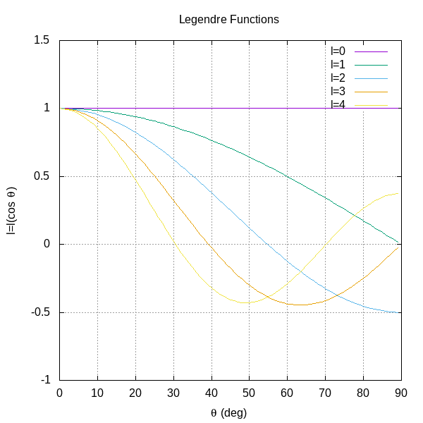
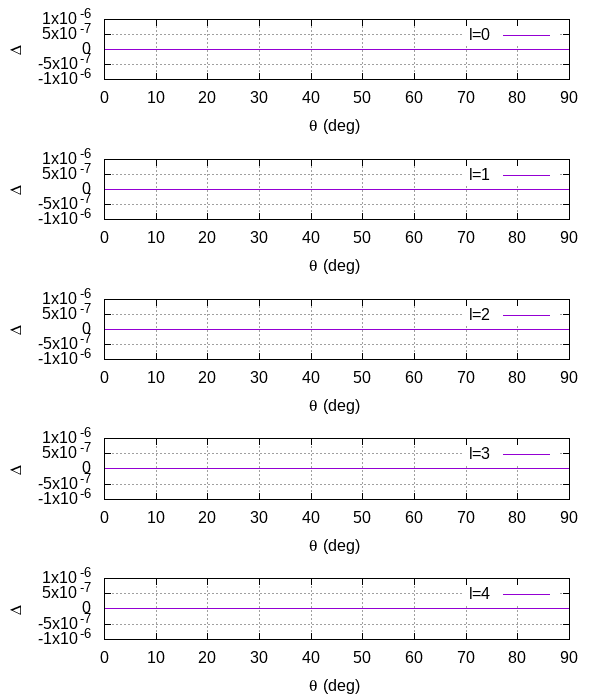

# Exercise 10
Write a C program to numerically calculate the Legendre polynomial and the associated Legendre functions for any value of L

## Results
  

It is possible to see that the plots are in accordance with what is expected. As a further proof I resolved to compare my results with the implementation available in the [GNU Scientific Library](https://www.gnu.org/software/gsl/).  

  

The error is below 1 part in $10^6$ therefore I resolve to use the GSL function from now on to speed up the computation.
