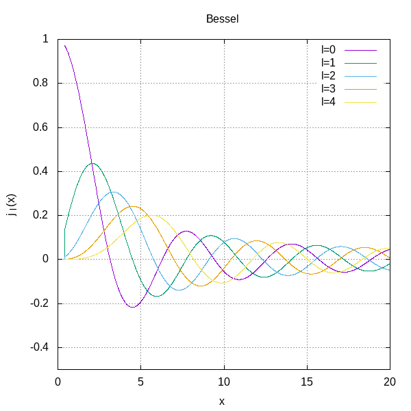
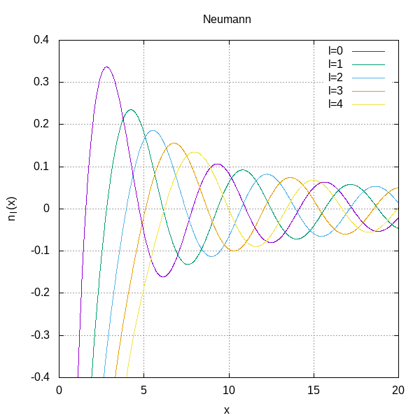
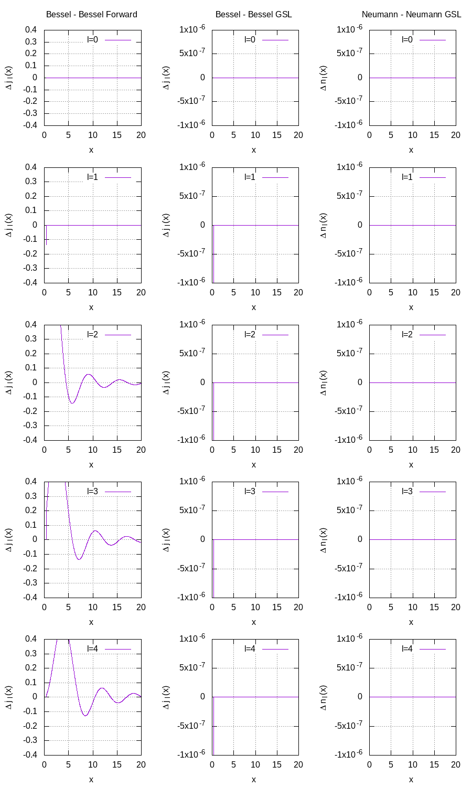
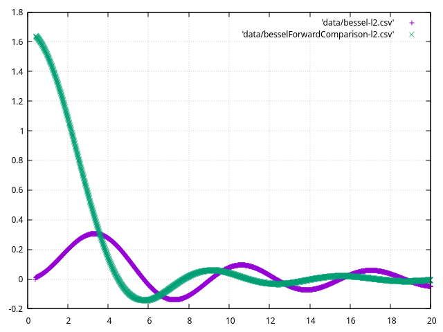

# Exercise 11
Write a C program to numerically calculate the spherical Bessel Functions.

## Results

It is possible to see that the plots are in accordance with what is expected. As further proof, I resolved to compare my results with the implementation available in the [GNU Scientific Library](https://www.gnu.org/software/gsl/) and the Bessel Forward method.  

  

In the second and third columns, the error is below 1 part in $10^6$ for the Neumann functions and 1 part in $10^6$ for the Bessel except for a single point. This is probably due to the value of EPSILON and the recursive procedure. I resolve to use the GSL function from now on to speed up the computation and assure consistency.

The behavior of the comparison between the forward and backward methods for computing the Bessel function made me think of an error. A plot of the Bessel and the error proved me wrong. The error has a sinusoidal behavior, probably due to the sinusoidal nature of the Bessel themselves.

