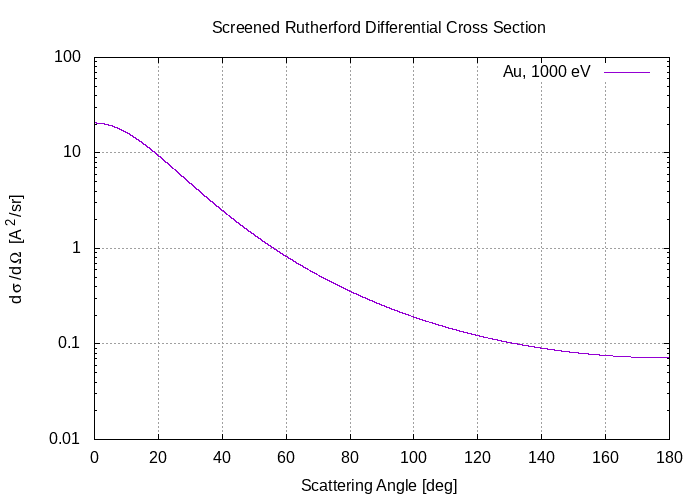

# Exercise 12
Write a C program to numerically calculate the screened Rutherford cross-section.

## Results

The plot correctly reproduces the one provided during the lectures.

### Side notes
As this exercise was a simple plot, I tried to use output on files instead of output on terminal.
